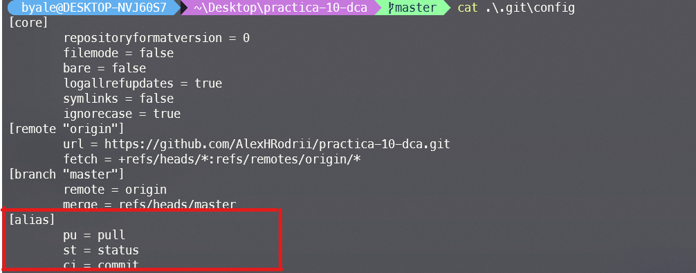
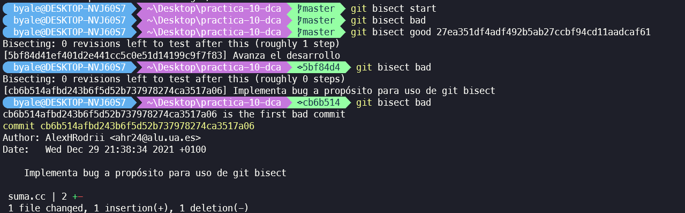

## Práctica Tema 10 - SCV de última generación - Alejandro Hernández Rodríguez

## Anotaciones de la práctica

### Alias locales y globales

Para crear alias locales se realiza el siguiente comando

```
git config alias.<alias> <operation>
```

Si queremos realizar un alias global unicamente se debe añadir el modificador *--global* y el alias se almacena en la configuración del usuario del PC no del repositorio local



### Uso de git bisect

Previamente se ha añadido un bug al código intencionadamente y mediante la herramienta git bisect se han ido recorriendo los commits para encontrar aquel donde se introdujo el fallo, se adjunta captura



### Hooks

El hook utilizado ha sido **commit-msg**
